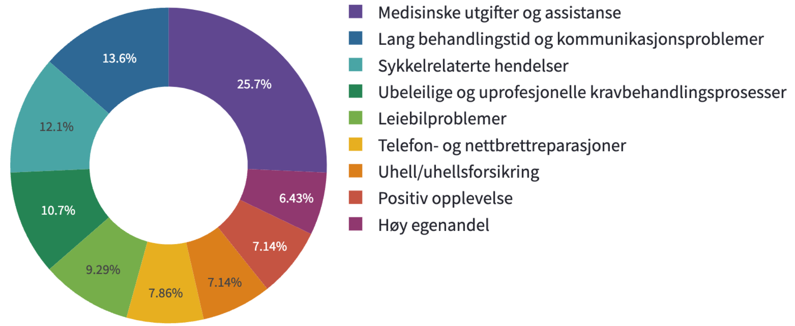

<!-- _class: invert -->
<!-- _paginate: false -->

<style scoped>
h3, p{
  display: inline-block;
  background-color: #000000;
  padding-left: 20px;
  padding-right: 20px;
  padding-top: 20px;
  padding-bottom: 20px;
}
</style>

### **Hardcoding airpods (and other stories from NLP in insurance)**
🍉 `emanuele.lapponi@fremtind.no (he/him)`
🍉 `murhaf.fares@fremtind.no (he/him)`


---
<style scoped>
h1{
    color: black
}
</style>

# About us 👋


---

# Insurance & ML

<style scoped>
h1{
  display: inline-block;
  font-size: 50px;
  color: white;
  padding-left: 20px;
  padding-right: 20px;
  padding-top: 20px;
  padding-bottom: 20px;
  margin-right: 500px;
}
</style> 

<style scoped>
p{
  display: inline-block;
  background-color: #80d9a3;
  font-size: 20px;
  padding-left: 20px;
  padding-right: 20px;
  padding-top: 20px;
  padding-bottom: 20px;
  margin-right: 500px;
}
</style> 


Typically concerned with **risk modeling** (pricing, AML, fraud) and **CRM**. But also **automation** and customer communication **insights**.


<!--
- Where does ML come into play here? 
- rolling in the background is one of our recruitment videos
- insurance is not only about compensating for damages, but also knowing where things can go wrong
- So stuff like risk modeling, pricing and fraud detection 

- Our NLP-niche is in customer communication insights 
- "how can we make our customers like us more", tough in insurance
- claims automation, or how do we settle a claim as fast as possible so that our customers like us more

Coming up in this talk:
-->

---


<!--
Some NLP battle stories about how we and why we built this Streamlit Frankenapp
-->

---


<!--
How we enabled automating that blue chunk of claims to the right of the sankey plot using basically search, which I understand you guys love.
-->

---

<style scoped>
p{
  font-size: 20px;
}
</style>

<style scoped>
h1{
  font-size: 40px;
}
</style> 

# About happy customers

Drivers for customer satisfaction in insurance:

🍉 Money
🍉 Speed
🍉 **Experience**


---
<style scoped>
h4{
  color: #FFFFFF;
  font-weight: bold;
  background-color: #4e7dd9;
  padding-left: 20px;
  padding-right: 20px;
  padding-top: 20px;
  padding-bottom: 20px;
  text-align: center;
}
</style>

<style scoped>
p{
  display: inline-block;
  font-size: 20px;
}
</style> 

#### _"The customer must always be met with precise and welcoming language"_

`I love you, best insurance EVER!1`

`You didn't pay me enough, you suck.`

`It took forever for the case to be resolved, burn in hell!`

`I felt like the case manager didn't believe me, and the appraiser was rude`

`Everything went great, but the terms are hard to understand, and the portal is hard to navigate.`

---

<style scoped>
p{
  font-size: 20px;
  padding-left: 20px;
  padding-right: 20px;
  padding-top: 20px;
  padding-bottom: 20px;

}
</style> 

# Relevance ranking


**Problem**: people don't have time to annotate. While we have some good 'vanilla' sentiment annotation, we lack specific ones on the phenomena that are relevant for different business streams.


--- 
# Weak supervision

```python
def lf_short_message_positive(x):
    if len(x.doc) < 5 and x.sentiment < 0.4:
        return 0
    return -1
```

```python
def lf_six_and_positive(x):
    if x.sentiment_score < 0.5 and x[dice_col_unc] == 6:
        return 0
    return -1
```

```python
def lf_contains_one_strong_and_negative(x):
    if x.sentiment >= 0.5 and contains_word(x.doc, ASSETS["UNCLARITY"]["strong"]) :
        return 1
    return -1
```


<!--- _footer: 'https://ai.stanford.edu/blog/weak-supervision/' -->
<!--

- ✋🏽 Raise of hand: who has heard of weak supervision?
- Programtic way of labelling your data
- Instead of labelling the data manually, we write so-called labelling functions that together approximate the true labels
- The labeling functions are based on domain knowledge, heuristics (rules), and output from other models
- Let's take an example:
- The x is the text in the customer feedback and the y a binary variable indicating whether the feedback message is about us being unclear or not
- ... Go through the labeling functions ... 

Labeling function outputs:
- aggregated using a simple method e.g. majority vote
- or train a model to learn the weights of the labeling functions; probabilistic graphical model

- now that we have our silver dataset, we can train a model on it
- and what do we do with those model?

-->
---


---
<!-- _class: invert -->

<style scoped>
p{
  font-size: 30px;
  text-align: center;
}
</style>

# <!-- fit -->Accuracy $≈$ Confidence

_E.g. For all samples with softmax probability 0.8, accuracy is 80%_


<!--

- a well calibrated model is a model whose accuracy is (almost) equal to its confidence
- say you have your classifier with a softmax at the end
- If the model makes 100 independent predictions, 
- each with a confidence p = arg max(p_hat) = 0.8, ideally, 
 - a calibrated model approximately gives 80 correct predictions

 - as turns out the good old negative log likelihood loss can sometimes lead to poorly calibrated models
-->

<!--- _footer: '[_Calibrating Deep Neural Networks using Focal Loss_ (Mukhoti et al., 2020)](https://proceedings.neurips.cc/paper/2020/file/aeb7b30ef1d024a76f21a1d40e30c302-Paper.pdf)' -->

---

# Let's get focal

<style scoped>
p{
  font-size: 18px;
  margin-left: 120px;
}
</style>

<style scoped>
h1{
  margin-left: 120px;
}
</style>

🍉 `cross_entropy` → poor calibration
🍉 ... which leads to a "peaky" distribution
🍉 Focal loss prevents overconfidence!


<!--- _footer: '[_Calibrating Deep Neural Networks using Focal Loss_ (Mukhoti et al., 2020)](https://proceedings.neurips.cc/paper/2020/file/aeb7b30ef1d024a76f21a1d40e30c302-Paper.pdf)' -->

<!-- 
- We observed that using cross-entropy the network grows more confident on its predictions irrespective of their correctness
  - which is strongly related to poor calibration
- Also reported in the literature: 
   "the entropies of the softmax distributions for both the correctly and incorrectly classified test samples decrease throughout training (in other words, the distributions get peakier)"
- that peaky distribution gives us basically the buckets of predictions that are difficult to rank

Solution: focal loss
- tackles overconfidence by weighting loss components generated from individual samples in a mini-batch by how well the model classifies them
- By focusing on these hard examples, focal loss helps the model to better calibrate its predictions and produce more accurate probability estimates
-->

---


---

<style scoped>
p{
  text-align: center;
}
</style>


## 🎂 Icing the topics with LLMs 



```
meat | organic | food | beef | emissions | eat | of | eating | is          -> Organic food
the | explosion | atmosphere | eruption | kilometers | of                  -> Exploding planets
immune | system | your | cells | my | and | is | the | how | of            -> How your immune system works
moon | earth | lunar | tides | the | water | orbit | base | moons          -> How tides work
eu | european | democratic | vote | parliament | member | union            -> How democratic is the European Union?
plastic | plastics | tons | pollution | waste | microplastics | polymers   -> Plastic pollution
```

<!--- _footer: 'https://maartengr.github.io/BERTopic/getting_started/representation/llm.html' -->

<!--
- they didn't want to read the messages either;
- what are the drivers behind the customers' feedback? what is the content of the messages?
- Clear case of topic modelling!
- won't delve into details  
- Used BERTopic
    - a library (or an algorithm) that enables building modular pipelines for topic modelling 
- What you get out of BERTopic is a set of clusters and the most representative words in each cluster
- Coworkers have no technical background; they won't understand it
- Enter LLMs: as BErtopic suggests we can use LLMs to represent the topics and we did just that
- Times permits: explain how we did (3-4 samples per topic, keywords and prompt)
- This is interesting because we couldn't have solved this problem without LLMs
-->

---

<style scoped>
h1{
  display: inline-block;
  font-size: 50px;
  color: white;
  padding-left: 20px;
  padding-right: 20px;
  padding-top: 20px;
  padding-bottom: 20px;
  margin-right: 500px;
}
</style> 

<style scoped>
p{
  display: inline-block;
  background-color: #80d9a3;
  font-size: 20px;
  padding-left: 20px;
  padding-right: 20px;
  padding-top: 20px;
  padding-bottom: 20px;
  margin-right: 500px;
}
</style>

# Automation

Customers submit claims via our website

They need to find the "object" type in our category tree

Upon choosing "other", they get prompted to describe the object

Automatic processing of claims depends on the object type!


<!-- 

- Processing insurance claims automatically
- Home insurance claims as an example:
- the customer goes to our website and fills out a form with the details of the claim
- in the form they have to choose what item or object has been damaged or lost
- well, sometimes the customers don't know what to choose and they pick "other"; 
- then they are asked to describe the item/object in question
- this is where we come in; 
- we need to classify the claim into the correct category to enable the claim to be processed further

-->

---


---
<!-- _class: invert -->


<style scoped>
h6{
  display: inline-block;
  font-size: 30px;
  color: #d27bdb;
  padding-left: 20px;
  padding-right: 20px;
  padding-top: 20px;
  padding-bottom: 20px;

}
</style> 

<style scoped>
code{
  font-size: 20px;
}
</style>

```lisp
(object-tree
  (Electronic-appliances
    (Computers-and-accessories (Mouse) (Laptop) (Display))
    (Small-electronics (E-cigarette) (Hearing-aids) (Hair-drier)))
  (Glasses-and-sunglasses (Reading-glasses) (Sunglasses)))
```

```
"Electronic appliances | Computers and accessories | Mouse"
"Electronic appliances | Computers and accessories | Laptop"
"Electronic appliances | Computers and accessories | Display"
"Small electronics | E-cigarette"
"Small electronics | Hearing aids"
"Small electronics Hair drier"
"Glasses and sunglasses | Reading glasses"
"Glasses and sunglasses | sunglasses"
```

###### We can turn the tree into flat classes, build a classifier and give the customer a top N ranking of classes, so they can choose the the right one.

<!-- 
- Now take a look at our category tree; 
- main category, sub-category, object 
- we flattened out the tree and treated this like a classification problem with top n categories
- so what do we need here to now? training data and let's go, right Eman?

-->

---
<!-- _class: invert -->

# <!-- fit--> Who changed the label?? 🤬

---


---

<!--- _footer: '[Rick Payne and team / Better Images of AI / Ai is... Banner / CC-BY 4.0](https://betterimagesofai.org)' -->>


<!--
- Try another embedding model (multilingual BERT)
- Ensemble of models or stacking embeddings
- Retrain the model or fine-tune it
- Use an LLM 

- Luckily someone came up with a brilliant I don't remember who
-->

---

```python
def postprocess(text, suggestions, scores):
    if "airpod" in text.lower():
        suggestions[0] = HEADPHONE_CAT
        scores[0] = 1
    return suggestions, scores
```


---
<!-- _class: invert -->

# <!-- fit--> 🌈 Thank you for having us! 🍉